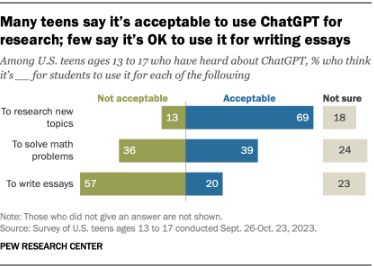

---
hide:
  - navigation
  - toc
---
# Applications of the Technology

## Real-World Examples

### 1. Education

One of the ways ChatGPT is used is in education. While many people believe that students only use this AI to cheat, there are actually multiple ways it can be used to aid learning. It has become such a common tool for students to use that some schools have banned the use of it. ChatGPT can be used as a tutor. For example, if you input a math problem it can teach you step by step how to solve it. It can also aid teachers by helping them come up with new creative ways of teaching.

Sources:

- [What Students Are Saying About ChatGPT](https://www.nytimes.com/2023/02/02/learning/students-chatgpt.html)

- [AI in Education: Leveraging Chat GPT in the Classroom](https://www.learning.com/blog/chat-gpt-classroom/)

### 2. Meal Planning

:max_bytes(150000):strip_icc():format(webp)/Screenshot2023-05-26at11.15.23AM-e0964b2423754e5b8fbfe2e3a9404354.jpg)

Another use for ChatGPT is meal planning. The user just has to input what they are looking for like high protein meals, their budget, and any allergies. ChatGPT will give you some ideas of what dishes you can make as well as how to make them. If needed, it can walk you step by step on how to create each meal. It can break down nutritional information like how many calories and grams of protein. It can also create a grocery list that meets your budget.

Source:

- [I asked ChatGPT to Make a Meal Plan: Here’s What Happened](https://www.shape.com/chatgpt-meal-plan-7503676)

### 3. Coding Support

ChatGPT is widely used in programming and development. It can explain code, help debug, write functions, and generate documentation. Many beginners use ChatGPT as a mentor to improve coding skills, especially when learning languages like Python or JavaScript. However overreliance has become a large problem for beginners as it can weaken their critical thinking and coding skills in the long run, especially when the basics of coding haven't been grasped. It also brings up issues in the long run on the cybersecurity side as the genAI may not be writing secure code when junior devs are expecting it to be.

Source:

- [The risks of entry-level developers over relying on AI](https://www.csoonline.com/article/3951403/the-risks-of-entry-level-developers-over-relying-on-ai.html)

---

## Complexities and Social Challenges

The biggest complexity with ChatGPT is how it’s used. As stated before, there is the discussion of it being used for the wrong reasons like to cheat on school work. An article states that over time, it doesn’t help students if they are just receiving answers and not learning the material. Students can also become too dependent on ChatGPT and lose their ability to problem solve or use critical thinking skills. However, it isn’t just students—people in the workplace also face similar issues.

There are also concerns about misinformation being spread as well as privacy concerns. Many users have reported that they have received inaccurate or false information. ChatGPT as well as other AIs have been targeted by cyber attacks and some of the users’ account credentials were leaked onto the dark web.

Sources:

- [Is Chat GPT helpful or harmful?](https://www.1851chronicle.org/post/is-chat-gpt-helpful-or-harmful)

- [5 Things That You Should Never Share With Chat GPT](https://agileblue.com/5-things-that-you-should-never-share-with-chat-gpt/)
